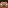
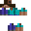

# NitroCraft

NitroCraft is a Minecraft avatar/render API built on Nitro and `minecraft-toolkit`.

<p align="center">
  
</p>

## Preview

| Steve Avatar | Alex Avatar | Steve Skin |
| --- | --- | --- |
|  |  |  |

## Quick Links

- [Contributing](CONTRIBUTING.md)
- [Docker Hub Overview](DOCKERHUB_OVERVIEW.md)
- [Pterodactyl Egg](pterodactyl%20egg/egg-nitrocraft.json)
- [License](LICENSE)

## Features

- UUID-based avatar, skin, cape, and render endpoints
- Username/UUID resolution endpoints via `minecraft-toolkit`
- Disk + metadata caching with Redis or memory backend
- Configurable outbound Mojang session rate limiting (`SESSIONS_RATE_LIMIT`)
- Optional inbound per-IP request rate limiting (`REQUESTS_RATE_LIMIT`)
- Nitro runtime with `pnpm` workflows

## API Endpoints

### Avatar, Skin, and Render

- `GET /avatars/{uuid}?size=160&overlay`
- `GET /skins/{uuid}`
- `GET /capes/{uuid}`
- `GET /renders/head/{uuid}?scale=6&overlay`
- `GET /renders/body/{uuid}?scale=6&overlay`

### Player Lookup

- `GET /players/{uuid-or-username}`
- `GET /players/{uuid-or-username}/profile`
- `GET /players/{uuid-or-username}/history`
- `GET /players/{uuid-or-username}/skin-metadata`

### Server Status

- `GET /status/mc`
- `GET /status/java?address=host`
- `GET /status/bedrock?address=host`
- `GET /status/server?address=host&edition=auto`
- `GET /status/icon?address=host`

### Text Formatting

- `GET /format/html?text=...`
- `GET /format/strip?text=...`
- `GET /format/css`

## Getting Started

### Local Development

```bash
corepack enable
nvm use
pnpm install
pnpm dev
```

### Build and Run Production Output

```bash
pnpm build
pnpm start
```

### Run Tests

```bash
pnpm test
```

## Docker

```bash
cp .env.example .env
docker compose up -d
```

## GitHub Actions (Docker Hub)

This repo includes a Docker publish workflow at `.github/workflows/docker-publish.yml`.

It runs on:
- Push to `master`/`main`
- Version tags like `v1.2.3`
- Daily schedule (`03:00 UTC`)
- Manual dispatch

Add these repository secrets in GitHub:
- `DOCKERHUB_USERNAME`
- `DOCKERHUB_TOKEN` (Docker Hub access token)
- `DOCKERHUB_REPOSITORY` (for example: `repgraphics/nitrocraft`)

## GitHub Actions (Build Releases)

This repo also includes `.github/workflows/build-release.yml`.

It:
- Runs `pnpm build`
- Packages `.output` as a tarball
- Publishes assets to the GitHub Release for the tag

Triggers:
- Push tags like `v1.2.3`
- Manual dispatch (provide an existing tag)

## Environment

Create a `.env` file and configure the following values.

| Variable | Purpose |
| --- | --- |
| `CACHE_BACKEND` | Cache backend: `redis`, `memory`, or `none`. |
| `REDIS_URL` | Redis connection string (used when `CACHE_BACKEND=redis`). |
| `SESSIONS_RATE_LIMIT` | Outbound Mojang session request limit. |
| `REQUESTS_RATE_LIMIT` | Enable/disable inbound per-IP request limiting. |
| `REQUESTS_RATE_LIMIT_WINDOW_MS` | Rate-limit window size in milliseconds. |
| `REQUESTS_RATE_LIMIT_MAX_KEYS` | Maximum tracked rate-limit keys. |
| `REQUESTS_RATE_LIMIT_TRUST_PROXY` | Proxy-trust behavior for client IP detection. |
| `REQUESTS_RATE_LIMIT_EXCLUDE` | Comma-separated routes/patterns excluded from inbound limits. |
| `STATUS_ALLOW_PRIVATE_TARGETS` | Allow private/local network addresses in `/status/*` probe endpoints (`false` by default). |
| `MAX_TEXTURE_BYTES` | Maximum allowed texture payload size. |
| `DEFAULT_REDIRECT_ALLOWLIST` | Comma-separated host allowlist for `default=` URL redirects (supports `*.example.com`). If unset, only `EXTERNAL_URL` host is allowed. |
| `CORS_ORIGIN` | Empty/`All` allows all origins; otherwise use a comma-separated allowlist. |
| `RETENTION_DAYS` / `RETENTION_MAX_AGE_HOURS` | Cache/data max age. |
| `RETENTION_INTERVAL_HOURS` / `RETENTION_INTERVAL_DAYS` | Cleanup schedule interval. |
| `PORT` | HTTP server port. |
| `BIND` | Bind address/interface. |
| `EXTERNAL_URL` | Public base URL used for generated external links. |

## Notes

- Render endpoints require native `canvas` dependencies in your runtime image/environment.
- Core image endpoints use UUID input. `/players/{uuid-or-username}` resolves usernames.

## Support

- Discord: [discord.euphoriadevelopment.uk](https://discord.euphoriadevelopment.uk/)

## License

MIT (see [LICENSE](LICENSE)).
